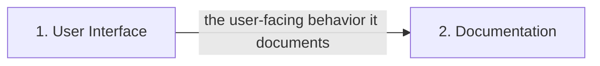

# Architecture — create hello world html one page app

## Overview

Technical architecture on a **recommended** stack (model-selected; not yet confirmed): HTML5, CSS3, JavaScript, GitHub Pages, Markdown. Confirm it or adjust via feedback before build.

Cross-feature dependencies are called out below so each feature is implemented against the contracts it relies on.

## Components

- **1. User Interface** (ui): front-end (components, forms, routing) — recommended HTML5, CSS3, JavaScript, GitHub Pages, Markdown.
- **2. Documentation** (documentation): project documentation — recommended HTML5, CSS3, JavaScript, GitHub Pages, Markdown.

## Data flow

## Cross-feature dependencies

- **Documentation** depends on:
    - **User Interface** (ui) — the user-facing behavior it documents.
