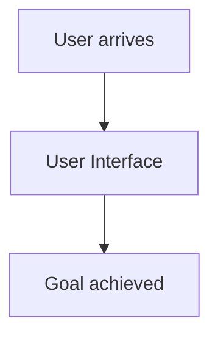

# Business Flow — create hello world html one page app

## Overview

Predicted 2 deliverable(s) [new_project] for: 'create hello world html one page app'. Active needs: user_interaction.

This is the business/domain view: the flows the system supports across its features, independent of any technology choice.

## Flows

### User Interface
Users interact through screens/forms, so a UI is required. (driven by: user_interaction)

## Journey

